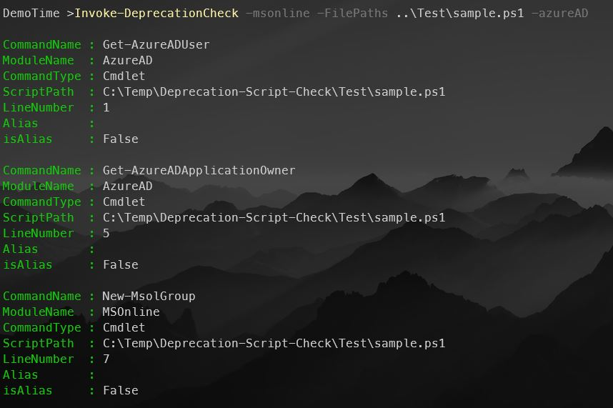

# Deprecation Check

This PowerShell Module checks for deprecated commands usage in PowerShell scripts.

## Modules Covered

[x]AzureAD
[x]AzureADPreview
[x]MSOnline

## Usage

Checks the scripts MyScript.ps1 and AnotherScript.ps1 for deprecated commands from the MSOnline module.

```Powershell
Invoke-DeprecationCheck -MSOnline -FilePaths "C:\Scripts\MyScript.ps1", "C:\Scripts\AnotherScript.ps1"
```



## Contributing

Contributions are welcome. Please submit a pull request.
